<!-- Banner -->

  

---

### 👋 Hello, I'm Sanket Hajare

🎓 Computer Engineering graduate and aspiring **Software Engineer**.

💻 Interested in **Backend Development, System Design, AI/ML, LLMs, and RAG**.

🚀 Building projects using **Java, Spring Boot, React, Node.js, and Python**.

🌱 Currently strengthening my skills in **DSA, System Design, Full-Stack Development, and Generative AI**.

📍 Pune, India

---

### 🛠️ Tech Stack

&nbsp;
&nbsp;
&nbsp;
&nbsp;

&nbsp;
&nbsp;
&nbsp;
&nbsp;

&nbsp;
&nbsp;

&nbsp;
&nbsp;
&nbsp;
&nbsp;

&nbsp;
&nbsp;
&nbsp;

---

### 🚀 Featured Projects

**[DevOverflow](YOUR_REPO_URL)**  
Stack Overflow-inspired developer Q&A platform built with Next.js, TypeScript, Tailwind CSS, and Clerk.

**[ParkEngine](https://github.com/SanketHajare44/park-engine)**  
Java-based Parking Lot Management System designed using OOP, Low-Level Design, SOLID principles, and Design Patterns.

**[File Packer Unpacker](https://github.com/SanketHajare44/File_Packer_Unpacker)**  
Full-stack file archiving application built with Java, Spring Boot, REST APIs, React, and JUnit for packing and unpacking files.

**[PullRequest](https://github.com/SanketHajare44/pullRequest)**  
Developer networking platform built with React, Node.js, Express.js, MongoDB, and Socket.IO for connecting and collaborating with developers.

---
### 📫 How to Reach Me

&nbsp;

&nbsp;

